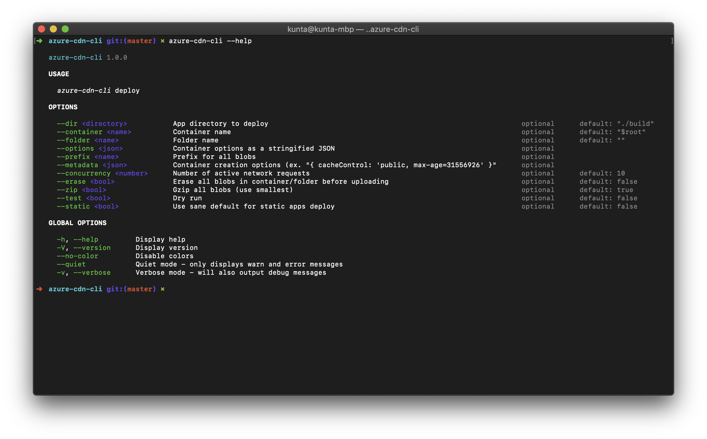

# azure-cdn-cli

A commodity utility for deploying webapps to Azure Storage Accounts.

## Env vars

This CLI use `azure-storage` under the hood so an
`AZURE_STORAGE_CONNECTION_STRING` env var is required to grant access.

## Example

```bash
azure-cdn-cli deploy ./build --test --static
```


